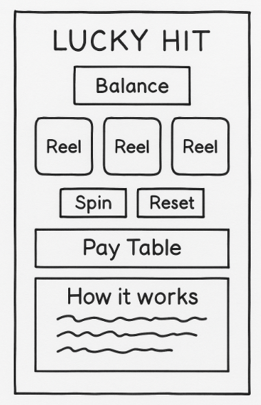
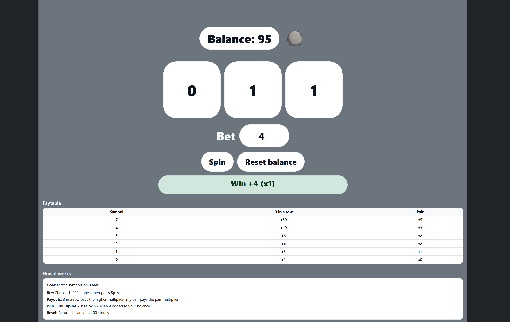

# Lucky Hit
[Link to page](https://emcion.github.io/LuckyHit/)

## Table of Contents
[UX](#ux)
  * [Goal for the Project](#goal-for-the-project)
  * [User Goals](#user-goals)
  * [User Stories](#user-stories)
  * [Site owner Goals](#site-owner-goals)
  * [Design Choices](#design-choices)
    * [Font](#font)
    * [Icons](#icons)
    * [Colours](#colours)
    * [Structure](#structure)
  * [Features](#features)    
  * [Future Plans](#future-plans)      
  * [Tehnologies used](#tehnologies-used)
    * [Languages](#languages)
    * [Tools](#tools)
  * [Testing](#testing)
  * [Deployment](#deployment)
  * [Credits](#credits)
## UX
## Goal for the Project

Build a simple, responsive 3-reel slot machine that’s easy to understand and quick to play. The game uses stones as currency and numbers as symbols (with room to expand later). It demonstrates core front-end skills: HTML, CSS, Bootstrap utilities, and vanilla JavaScript with basic state management via localStorage.

### User Goals

* Spin a simple slot machine and see clear results.

* Understand payouts quickly via a paytable.

* Control their bet and track balance easily.

* Play comfortably on mobile and desktop.

### User Stories

* As a player, I want to set my bet and spin so I can try to win stones.

* As a player, I want to see my current balance clearly at all times.

* As a player, I want to know how much each symbol pays.

* As a player, I want the interface to be simple and readable.

### Site owner Goals

* Practice semantic HTML, responsive CSS, and Bootstrap utilities.

* Use vanilla JavaScript for game logic and DOM updates.

* Persist small pieces of state with localStorage (balance, bet).

* Keep the codebase small, readable, and beginner-friendly.

### Design Choices
#### Font

* Roboto from Google Fonts for clean readability and a modern look.

#### Colours

* Light UI components on a dark canvas to draw focus to reels and balance.

* White cards/buttons (#fff) on dark background for contrast.

* Accent feedback via Bootstrap alerts (info/success/danger) for wins/losses.

### Structure

* One‑page layout wrapped in a Bootstrap card.

* Central balance with a stone coin image.

* Three large reels with clear typography for the symbols.

* A bet control and two primary actions: Spin and Reset balance.

* Paytable + "How it works" help card.

### Wireframes

### Features

* Persistent balance & bet — stored in localStorage under lucky.balance and lucky.bet.

* Bet limits — clamped to 1–200 and coerced to whole numbers.

* Animated spin — reels nudge while spinning.

* Win detection — 3‑of‑a‑kind uses the full line table; any pair uses the pair table.

* Responsive — large touch targets and scalable type.

#### Screenshots

- Desktop

- Mobile

### How to Play

* Set your Bet (1–200 stones).

* Click Spin. Your bet is deducted immediately.

* The reels stop left → right. If you hit:

* Three in a row — you’re paid the full line multiplier × bet.

* Any pair — you’re paid the pair multiplier × bet.

* Winnings are added to your Balance. Click Reset balance to return to 100 stones.

* The paytable is shown in‑game and reproduced here:

### Future Plans

* Add symbol art and a themed skin switcher.

* Sound effects and win jingles (with a mute toggle).

* Auto‑spin with loss/stop limits.

* Bonus round ideas (e.g., re‑spin wilds).

* Increasing number of reels.

### Tehnologies used
#### Languages

* [HTML](https://en.wikipedia.org/wiki/HTML5)

* [CSS](https://en.wikipedia.org/wiki/CSS)

* [JavaScript](https://en.wikipedia.org/wiki/JavaScript)

#### Frameworks and Libraries

* [Google fonts](https://fonts.google.com) - Used for text font on page.

* [balsamiq](https://balsamiq.com/) Balsamiq used to create wireframes

#### Tools

* [Gitpod](https://gitpod.io/workspaces) - Used for building the website.

* [Github](https://github.com/) - Used to deploy the project.

* [Vs code](https://code.visualstudio.com/) - Used for building the website.

* [W3C HTML Validation Service](https://validator.w3.org/) - Used to test HTML.

* [W3C CSS Validation Service](https://jigsaw.w3.org/css-validator/) - Used to test CSS.

* [Devtools](https://developer.chrome.com/docs/devtools/#:~:text=Chrome%20DevTools%20is%20a%20set,you%20can%20open%20Chrome%20DevTools.) - I checked all the time how my code works and if there are any errors in console

## Teseting

### Deployment
* Go to the Settings tab of your GitHub repo.

* On the left-hand sidebar, in the Code and automation section, select Pages.

* Make sure:

  - Source is set to 'Deploy from Branch'.

  - Main branch is selected.

  - Folder is set to / (root).
* Under Branch, click Save.

* Go back to the Code tab. Wait a few minutes for the build to finish and refresh your repo.
* On the right-hand side, in the Environments section, click on 'github-pages'.

* Click View deployment to see the live site. The URL will look similar to [Link to page](https://emcion.github.io/LuckyHit/)

### Credits

* [DeepAI](https://deepai.org/machine-learning-model/text2img) Images: Free images generated for project needs.

* Fonts: Roboto from Google Fonts.

* [Code Institute](https://codeinstitute.net/ie/): A special acknowledgment to the Code Institute. Revisiting lessons there proved invaluable, reinforcing core concepts and strengthening my foundation.

* [YouTube Tutorials](https://www.youtube.com/): Many thanks to the numerous educators and developers on YouTube. Their shared knowledge and step-by-step tutorials provided clarity and depth to my understanding.

* [Stack Overflow](https://stackoverflow.co/): An essential resource during this journey. The community's expertise and shared experiences on Stack Overflow were immensely beneficial in navigating challenges and troubleshooting issues.

* I was helping myself with resources gathered during building my different projects.

* A big thank you to my friend who turned out to be a great game tester.
